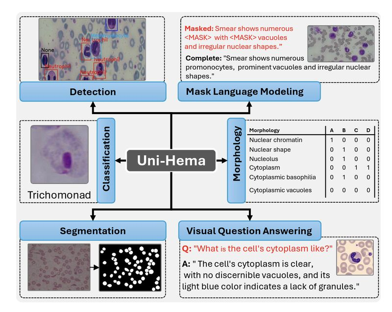

# Uni-Hema: Unified Model for Digital Hematopathology


**Authors:** Abdul Rehman, Iqra Rasool, Ayisha Imran, Mohsen Ali, Waqas Sultani


**CVPR 2026**
##Paper 
[PDF]([https://openaccess.thecvf.com/content/CVPR2026/papers/Rehman_Uni-Hema_Unified_Model_for_Digital_Hematopathology_CVPR_2026_paper.pdf])
---

## Overview

Uni-Hema is a unified multi-task, multi-modal framework for comprehensive cell-level analysis across hematological diseases.  
It integrates detection, classification, segmentation, morphology prediction, and clinical reasoning — trained on 46 public datasets with 700K+ microscopy images.

---
## Installation

<details>
  <summary>Installation</summary>
  
  We use the same environment as DAB-DETR, DN-DETR, and DINO. If you have run DN-DETR or DAB-DETR, you can skip this step. 
  We test our models under ```python=3.7.3,pytorch=1.9.0,cuda=11.1```. Other versions might be available as well. Click the `Details` below for more details.

   1. Clone this repo
   ```sh
   git clone https://github.com/intelligentMachines-ITU/Uni-Hema.git
   cd DINO
   ```

   2. Install PyTorch and torchvision

   Follow the instructions on https://pytorch.org/get-started/locally/.
   ```sh
   # an example:
   conda install -c pytorch pytorch torchvision
   ```

   3. Install other needed packages
   ```sh
   pip install -r requirements.txt
   ```

   4. Compiling CUDA operators
   ```sh
   cd models/dino/ops
   python setup.py build install
   # unit test (should see all checking is True)
   python test.py
   cd ../../..
   ```
</details>
  
## Demosntrarion  
Demonstration can be performed by running the following bash script:


```
python app.py
 
```

---
Step1: Select the task (detection, Segmentation, Classification, VQA )

Step2: Select the image or upload 

Step3: Run the Inference 

## Dataset  
1: All the datasets are publicly available, and the details are given in the supplementary. 
2: The annotations of all the training and testing datasets are available in the dataset_annotation folder. 

## Single Cell linear classifier model training and testing   
```
Set the train and test paths w.r.t the single-cell datasets
python uni_hema_Scc.py

```
## Traning 
```
python main_unihema.py \
    -c config/DINO/DINO_4scale.py \
    --output_dir ./step2/ \
    --coco_path ./  \
    --options embed_init_tgt=TRUE
```
---
## Citation

```bibtex
@inproceedings{rehman2026uni,
  title={Uni-Hema: Unified Model for Digital Hematopathology},
  author={Rehman, Abdul and Rasool, Iqra and Imran, Ayisha and Ali, Mohsen and Sultani, Waqas},
  booktitle={Proceedings of the IEEE/CVF Conference on Computer Vision and Pattern Recognition},
  pages={37578--37589},
  year={2026}
}
